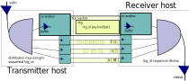

### viamillipede:
Fast, resiliant, network transparent pipe tranport. 


Viamillipede is client/server program built to improve pipe transport across networks by using multiple TCP sessions. It demultiplexes stdin into multiple buffered TCP connectons and then terminates the connections into stdout on another host. Order is guaranteed and the pipe is transparent to the source/sink programs. It is as simple to use as Netcat and can generate large throughputs.

#### Problems With existing approaches:
TCP connections are friable and IP is best effort to preserve its ecomony.  TCP was not engineered for resiliance or longevity for a single flow.  Relying on a single TCP connection to succeed or perform is not defendable in software. 
### typical pathology:

 + `tar cf - / | /bin/dd obs=1m 2> /dev/null | /bin/dd obs=1m 2> /dev/null| /usr/local/bin/pipewatcher | ssh mal "tar xf- "` 
 + double serial penalty, note latent mistake causing 1B reads
 + Extra pipe steps impose 'serial resistance' to throughput.
 + desperately superstitious optimizations are premature and not generally applicable
 + ssh is not the tool for every situation 
 + a fixed pipeline is not tuned for any system
 + SMP ignorance, Cpu's either lonely forever or hotspotted.
 + underused tx/rx interrupt endpoints, pcie lanes, NIC channel workers, memory lanes and flow control.
 + networks are tuned against hot single tcp connections; that is hard to fix
 + poor mss window scaling. Congestion controls aggressively collapse when network conditions are not pristine.
 + large bandwidth latency product vs. contended lans; both penalized due to 'impedence mismatches') 
 + Poor buffer interactions eg: "Shoe shining" delays. 
 + NewReno alternatives are not often acceptable.
 + Flows are stuck on one L1/L2/L3 path.  This defeats the benefits of aggregation and multi-homed connections.
 + Alternate Scatter gather transport is usually not pipe transparent and difficult to set up; eg: pftp, bittorrent, pNFS
 + Your NOC will do maintenance in intervals shorter than your network transport windows.

#### Goals and Features of viamillipede:

+ Provide:
     + Fast transparent  delivery of long lived pipes across typical networks.
     + Runtime SIGINFO inspection of traffic flow.`( parallelism, worker allocation, total throughput )`
     + Resilience against dropped TCP connections and read links.
+ Increase traffic throughput by:
	+ Using parallel connections that each vie for survival against adverse network conditions.
	+ Using multiple destination addresses with LACP/LAGG or separate Layer 2 adressing.
	+ Permit adequate buffering to prevent shoe shining. 
	+ Return traffic is limited to ACK's to indicate correct operations
+ Specified Traffic Shaping:
     + Steer traffic to preferred interfaces.
     + Use aggregated link throughput in a user specified sorted order.
+ Future plans  `(*)`
     + Make additional 'sidechain' compression/crypto pipeline steps parallel.
     	+ hard due to unpredictable buffer size dynamics
        + sidechains could include any reversable pipe transparent program
        + gzip, bzip2
        + openssl
        + rot39, od
     + xdr/rpc marshalling for architecture independence
     	+ serializing a struct is not ideal
     + reverse channel capablity 
          + millipedesh ? millipederpc?
	  + specify rx/tx at the same time + fifo?
	  + is this even a good idea? Exploit generator?
	  + provide proxy trasport for other bulk movers: rsync, ssh OpenVPN
	  + error feedback path more that ack
	  + just run two tx/rx pairs?
+ Error resiliance: TCP sessions are delicate things
     + Restart broken TCP sessions on alternate transport automatically. 
     + Bypass dead links at startup; retry them later as other network topology changes are detected.
     + self tuning worker count, side chain, link choices and buffer sizes, Genetic optimization topic? `(*)`
     + checksums, not needed, but it's part of the test suite, use the 'checksums' transmitter flag to activate
     + error injection via tx chaos <seed> option - break the software in weird ways,  mostly for the test suite
     + programmable checkphrase  uses a 4 character checkphrase to avoid confusion rather than provide strong authenticaion

+ Simple to use in pipe filter programs
     + Why hasn't someone done this before? 
     + IBM's parallel ftp for SP2 z/os, bittorrent: not pipe transparent. 
     + Hide complexity of parallel programming model from users.

`(*)` denotes work in progress, because "hard * ugly > time"
#### Examples:

### Simple operation
     + Configure receiver  with rx <portnum>
	` viamillipede rx 8834  `
     + Configure transmitter with  tx <receiver_host> <portnum> 
	` echo "Osymandias" | viamillipede tx host1.yoyodyne.com 8834  `
	
### Options:
+ `rx <portnum> ` Become a reciever. 
+ `tx <host> <portnum> ` Become a transmitter and add transport graph link toward an rx host. Optionally provide tx muliple times to inform us about transport alternatives. We fill tcp queues on the first entries and then proceed down the list if there is more input than link throughput.  It can be helpful to provide multiple ip aliases to push work to different nic channel workers and balance traffic across LACP hash lanes. Analysis of the network resources shold inform this graph. You may use multiple physical interfaces by chosing rx host ip's that force multiple routes.
     + The source and destination machine may have multiple interfaces and may have:
          + varying layer1 media ( ethernet, serial, Infiniband , 1488, Carrier Pidgeon, insects, ntb)
          + varying layer2 attachment ( vlan, aggregation )
          + varying layer3 routes ( multihomed transport )
     + Use the preferred link.  Should you saturate it,  fill the next available link.
```
	tx host1.40g-infiniband.yoyodyne.com\
	tx host1a.40g-infiniband.yoyodyne.com\
	tx host1.internal10g.yoyodyne.com\
	tx host1.internal1g.yoyodyne.com\
	tx host1.expensive-last-resort.yoyodyne.com

```
+ verbose  <0-20+>, 
	+ transmitter or receiver
	` viamillipede rx 8834   verbose 5 `
+ threads <1-16> control worker thread count 
	+ (only on transmitter)
	` viamillipede tx foreign.shore.net 8834 threads 16 `
+ checksum (only on transmitter) with threads
	` viamillipede tx foreign.shore.net 8834 checksum `
+ chaos <clock divider> add error via chaos
     + transmitter only
     + periodically close sockets to simulate real work network trouble  and tickle recovery code
     + deterministic for how many operations to allow before a failure
     + `viamillipede tx localhost 12334 chaos 1731`
+ checkphrase <char[4]> provide lightweight guard agaist a stale or orphaned reciever,
     + not a security mechanism
      Transmitter and Reciever word[4] must match exactly.
     
### Use case with zfs send/recv:
+ Configure transmitter with  tx <receiver_host> <portnum>  and provide stdin from zfs send	
     ` zfs send dozer/visage | viamillipede tx foriegn.shore.net 8834  `
+ Configure receiver  with rx <portnum>  and ppipe output to zfs recv
     `viamillipede rx 8834   | zfs recv trinity/broken `

### Use outboard crypto: viamillipede does not provide any armoring against interception or authentication
+ use ipsec/vpn and live with the speed
+ provide ssh tcp forwarding endpoints
	+ from the tx host:` ssh -N -L 12323:localhost:12323 tunneluser@rxhost `
	+ use mutiple port instances to  get parallelism
	* use a trusted peers tcp encapuslation tunnel to offload crypto
+ use openssl in  stream, take your crypto into your own hands
	+ ` /usr/bin/openssl enc -aes-128-cbc -k swordfIIIsh -S 5A  `
	+ choose a cipher that's binary transparent  
	+ appropriate  paranoia vs. performance up to you
	+ enigma, rot39, morse?

